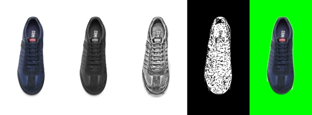
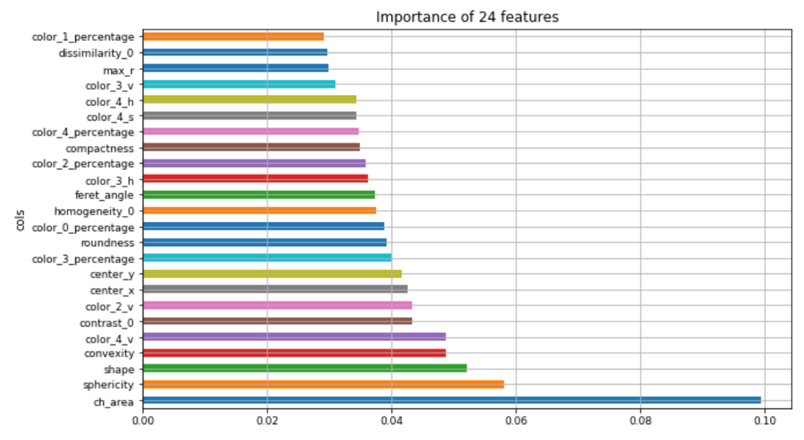
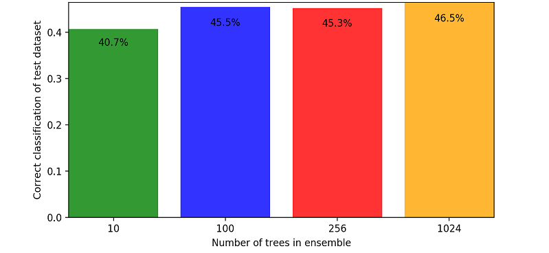
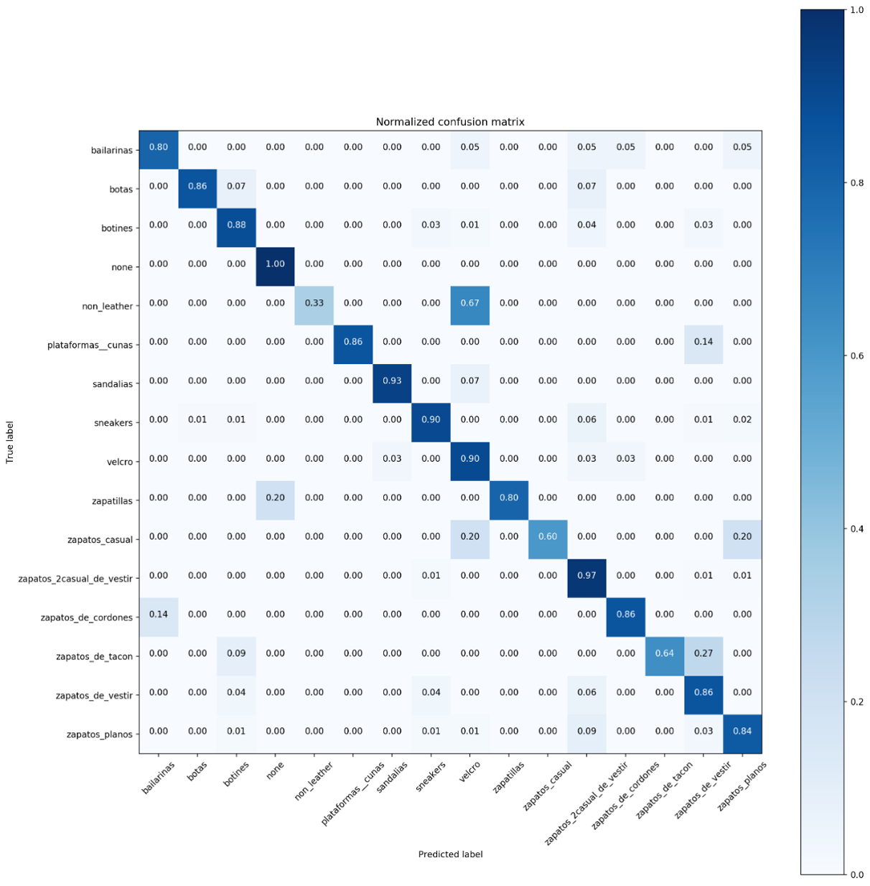

# Classification of shoe images using techniques of computer vision and machine learning

Document for The Final Project done during Erasmus mobility on
Universitat de les Illes Balears ([UIB](https://www.uib.eu/)) in Palma,
Mallorca.

[Camper](https://www.camper.com) provided the dataset.

    Computer Engineering
    Classification of shoe images using techniques of computer vision and machine learning
    IVAN KOMATINA
    Tutors
    Dr. Antoni Jaume-i-Capó
    Dr. Gabriel Moyà
    
    Escola Politècnica Superior
    Universitat de les Illes Balears
    Palma, 31 de gener de 2019

